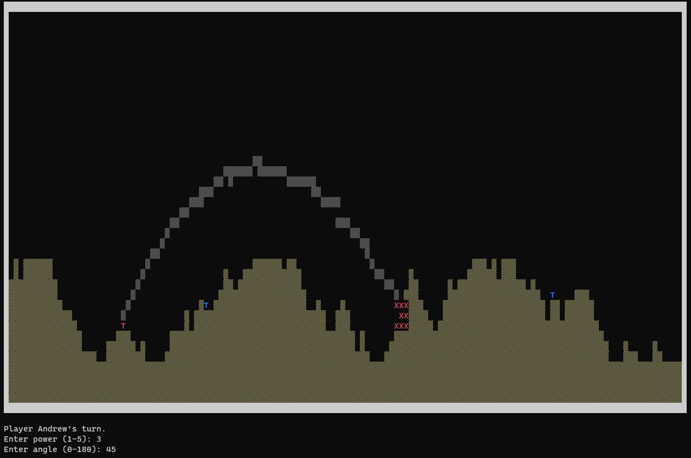

<h1>Tank Game</h1>

Tank Game is a simple yet engaging game developed in C. It's designed for two or more players, where each player controls a tank placed on a terrain. The objective is to strategically fire projectiles at opponents, with an aim to be the last tank standing.

<h2>Features</h2>
<ul>
    <li><strong>Multiplayer Gameplay:</strong> Supports 2-5 players.</li>
    <li><strong>Dynamic Terrain:</strong> The game field is randomly generated, offering a unique experience each time.</li>
    <li><strong>Explosion Effects:</strong> Visual representation of explosions when tanks get hit.</li>
    <li><strong>Turn-Based Mechanics:</strong> Players take turns to aim and fire at their opponents.</li>
</ul>

<h2>How to Play</h2>
<ol>
    <li><strong>Set Number of Players:</strong> Choose between 2 to 5 players.</li>
    <li><strong>Enter Player Names:</strong> Customize the names of each player.</li>
    <li><strong>Start Game:</strong> Begin the game with randomly generated terrain.</li>
    <li><strong>Player Turns:</strong> Each player chooses the power and angle to fire their projectile.</li>
    <li><strong>Winning the Game:</strong> The last tank remaining wins the game.</li>
</ol>

<h2>Compilation and Execution</h2>

To compile and run the game, ensure you have a C compiler installed. Use the following commands:

<pre>
<code>gcc -o TankGame Tanks.c
./TankGame</code>
</pre>

    <h2>Game Screenshot</h2>

<h2>Authors</h2>
<ul>
    <li>Ondřej Pomkla</li>
    <li>Jiří Řeháček</li>
</ul>

Developed as part of a project for VUT FEKT BPC-AUD AUDB-ZVUK, BPC-PC1T course.

</body>
</html>
